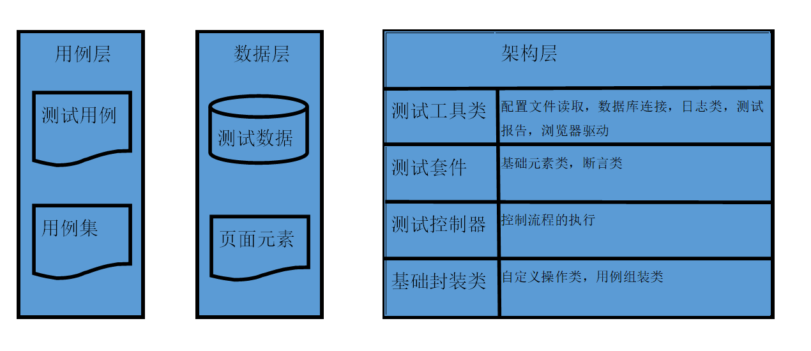

## UI自动化项目解释文档
### 目录结构
> - basefactory 浏览器基础操作，启动浏览器封装，原生元素操作封装
> - caseDir 测试用例文件存放点，在使用Excel表单形式时使用
> - common 基础操作封装，组装用例，读取Excel表单数据，执行步骤
> - \- customFunction 自定义封装，用于复杂操作适用于单个用例或少部分用例
> - testCase 测试目录，存放测试用例，测试数据，业务操作
> - \- excuteData 测试数据
> - \- page_obj 页面元素操作,单一页面方法
> - \- commonCase 公共用例
> - testReport 测试结果
> - \- Logs 执行日志
> - \- ScreenCapture 截图
### 项目架构图

### 用例书写规范
1. 编写用例时需要调用 @unittest.skipIf() 语法糖 
> - skipIf函数当condition等于True时执行用例，反之则不执行
> - 写法 @unittest.skipIf(RunLevel.skip_case(case_level=2), "执行等级小于设定等级 2，跳过该用例执行")
> - 定义用例执行优先级1-5 1最大5最小 注意：这里定义的优先级与执行顺序无关
2. 测试用例文件名称必须以test_开头 如test_login_case.py
> - 解释：项目中使用到测试用例集管理，如文件命名未按照规划批量执行时将不会加入用例集执行
3. 测试用例需要写备注，备注该用例测试点和检查点
> -     """
        该用例测试用户登录，检查首页加载完成首页看板文案
        :param phone: 手机号
        :param sms: 验证码
        :return:
        """
4. 公共用例用common_开头，公共用例中方法不能以test_开头